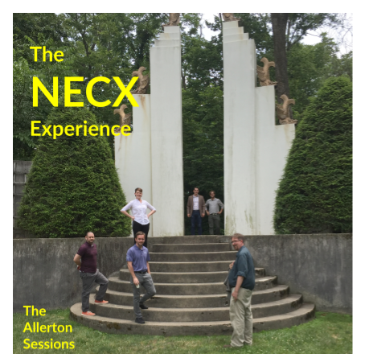
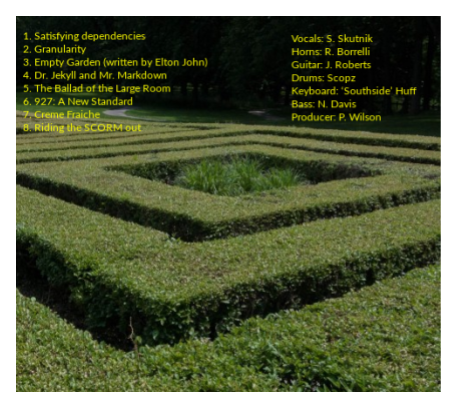

## Deliverables

The minutes from the workshop can be found in Google Drive 
[here](https://docs.google.com/document/d/1MCxKVLFoRC7MO98AIGGeGgc8HIHfXkv0J5IcJp-4VQk/edit?usp=sharing). 
During the workshop, in addition to sharing our ideas, we established a GitHub 
organization, identified near term decision making procedures, established long 
term goals as well as semester-length commitments.

Finally, collaborator Paul P.H. Wilson snapped (and modified) this excellent 
photo of the group. Prof. Wilson is not pictured.

